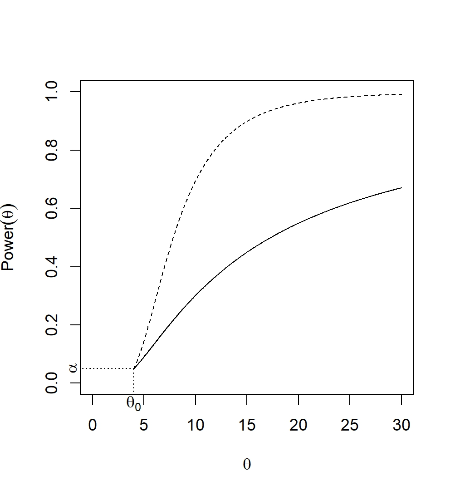
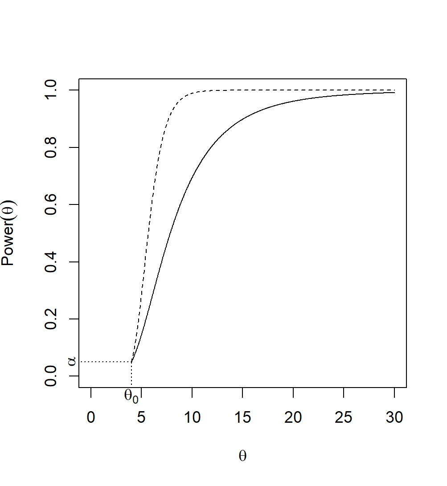
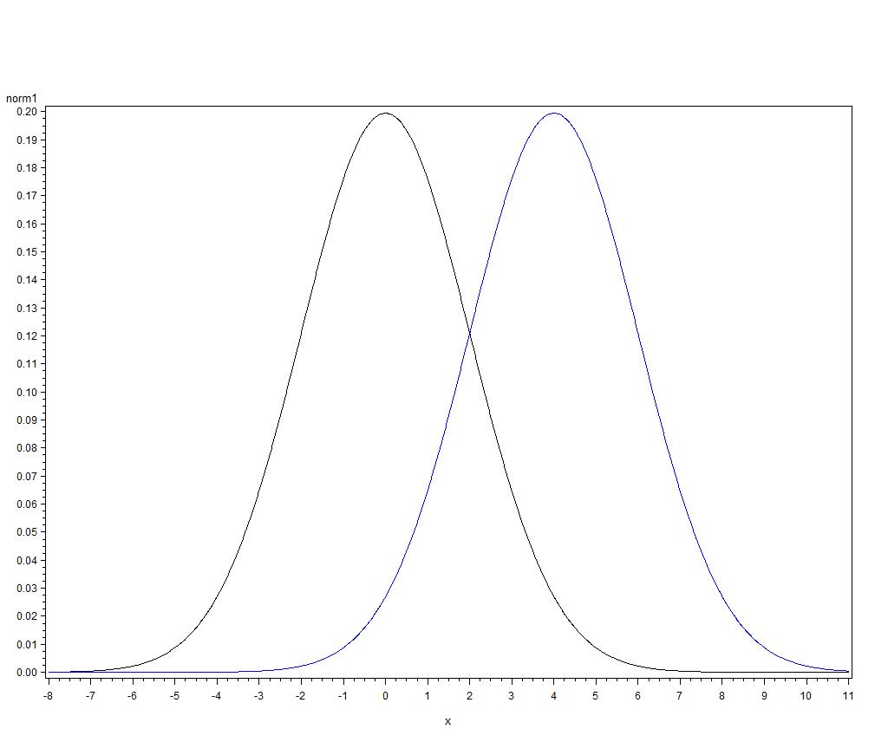

# Hypothesis Testing

::: callout-tip
# Definition: Statistical inference

**Statistical Inference** refers generally to the methods by which one makes inferences or generalizations about a population and its parameters based on statistics calculated from sample data. These methods can be classified broadly into three forms:

- **Point estimation** is the process by which an estimator of an unknown parameter, or function of parameters, is chosen and evaluated.

- **Interval estimation** is the process by which an observed value of a statistic and the statistic's probability distribution are used to create a range of plausible values of an unknown parameter, or function of parameters.

- **Hypothesis testing** is the process by which an observed value of a statistic and the statistic's probability distribution are used to evaluate the plausibility of a statement made about the unknown value of a parameter.
:::

We typically want to use the information contained in sample data to make inferences/decisions about a population and/or its paramters. So far, we've talked about how to find estimators, and how to evaluate the "goodness" of these estimators. Sometimes we are interested in not only estimating the parameter, but also in evaluating the plausibility of some statement about the unknown parameter. For example, we might be interested in asking questions like:

- does a new vaccine decrease the incidence rate of the flu?
- does the addition of citric acid to water extend the life of cut roses?
- does one section of a course understand the material in a class better than another section?
- does a professional development program for teachers increase student learning?

In each case, there is an underlying parameter $\theta$:

- incidence rate of the flu
- cut rose lifespan
- "amount" of student understanding
- "amount" of student learning

The goal of hypothesis testing is to determine if $\theta$ changes in specified ways when an element of the system is changed. For example, does the incidence rate of the flu decrease when the new vaccine is used in place of the old vaccine? Does the lifespan of a cut rose increase when citric acid is added to the water? A **hypothesis test** is a rule used to choose between two complementary hypotheses. Just as we saw that not all estimators are created equally, not all hypothesis tests are equally "good." We'll spend the next few weeks discussing hypothesis tests, including new definitions and notation, choosing between tests, and two methods for deriving hypothesis tests.

## Elements of a Hypothesis Test

### Hypotheses {.unnumbered}

The objective of a hypothesis test is to answer a question about an unknown population parameter $\theta$, which can take on any value in the parameter space, $\Theta$. Remember that the parameter space gives all of the possible values of the parameter.

\

The parameter space $\Theta$ is partitioned into two complementary spaces: $\Theta_0$ and $\Theta_a$. Because this is a partition, we assume that $\Theta=\Theta_0 \cup \Theta_a$ and $\Theta_0 \cap \Theta_a = \emptyset$. These two complementary spaces are used to form the corresponding complementary **hypotheses** for the question we wish to answer:

- **Null hypothesis** (H$_0$): the unknown $\theta \in \Theta_0$

  The null hypothesis can be thought of as the "no change" hypothesis. It is often a statement that changing the element of the system does not result in a change in the parameter $\theta$ (though not always).

- **Alternative Hypothesis** (H$_a$): the unknown $\theta \in \Theta_a$

  The alternative hypothesis is the complement of the null hypothesis. This means it is often the "change" hypothesis; changing the element of the system does indeed result in a change in the parameter $\theta$.

**Example**: Are more than half of all "Henry Moore" prints for sale on auction sites fake?

What are the population parameter, null and alternative hypotheses, and the parameter space for the research question? What are $\Theta_0$ and $\Theta_a$?

\
\
\
\
\
\
\
\

\newpage

### Test Function {.unnumbered}

A hypothesis test is a rule by which the data are used to choose between H$_0$ and H$_a$. This rule is an indicator function that will lead us to one of two decisions: $$
\phi(X_1,\dots, X_n) = \left \{ \begin{array}{ll} 1 & \hbox{reject H}_0 \\ 0 & \hbox{fail to reject H}_0 \end{array} \right . .
$$

The set $\{X_1,\dots,X_n\}$ such that $\phi(X_1,\dots, X_n) = 1$ is the **rejection region**.

**Example**: Suppose an art expert will determine the authenticity of a random sample of 15 purported Henry Moore prints.

What would be a reasonable rule for deciding between the two hypotheses? What factors are important to consider when determining the rule? What factors do you think make a test "good?"

\
\
\
\
\
\
\
\
\
\
\
\
\
\
\

### Data {.unnumbered}

We observe random variables $X_1,\dots, X_n$ (not necessarily iid), where the distribution of $X_1,\dots, X_n$ depends on the unknown $\theta$.

**Example**: Suppose the 15 random variables in our sample had the following observed values: 1, 0, 1, 1, 1, 1, 0, 1, 1, 1, 0, 1, 0, 1, 1, where a 1 means the print was fake and a 0 means the Henry Moore was authentic.

\newpage

### Test Statistic {.unnumbered}

We calculate the value of the **test statistic**, which is a function of the realized (observed) values $x_1,\dots, x_n$, on which the decision will be based. The test statistic is specified by the rule $\phi(X_1,\dots,X_n)$.

**Example**: What is the observed value of the test statistic specified above?

\

### Decision {.unnumbered}

We make a decision based on the value of test statistic. We either reject H$_0$ or fail to reject H$_0$.

**Example**: Based on the decision rule above and the observed value of the test statistic, what decision would you make? How would you answer the research question?

\
\
\
\
\

### Errors {.unnumbered}

Any time we construct a hypothesis test, there are two possible errors we can make:

- **Type I Error**: Reject H$_0$ when it is true
- **Type II Error**: Failing to reject H$_0$ when it is false

\
\
\
\
\
\
\
\
\
\

\newpage

**Example**: In the Henry Moore article, each print was evaluated by an expert to determine if the print is fake.

- What are the two hypotheses?

\
\
\
\

- What would constitute a Type I error? A Type II error?

\
\
\
\
\
\

- In this situation, which error do you think is worse?

\
\
\
\

Consider a test which **always rejects** H_0. That is, $\phi(X_1,\dots, X_n) = 1$. What happens to the probability of committing each type of error?

\
\
\
\
\

Consider a test which **always fails to reject** H_0. That is, $\phi(X_1,\dots, X_n) = 0$. What happens to the probability of committing each type of error?

\
\
\
\

\newpage

## Hypothesis Testing Strategy

Our overall strategy is: Minimize P(Type II error) subject to a bound on P(Type I error).

That is, we first specify the P(Type I error) we are willing to tolerate, and then (if possible) find the test that has the minimum P(Type II error). Equivalently, we find the test with the maximum sensitivity for a given level of specificity.

\
\
\

To do this, we'll use the **power function.**

::: callout-tip
# Definition: Power function

The **power function**, $power(\theta$), of a hypothesis test, $\phi$, is the probability the test will lead to rejection of H$_0$ when the actual parameter value is $\theta$. That is,

$$
power(\theta) = \hspace{200mm}
$$

- If $\theta_a$ is a value of the parameter in the alternative space, i.e., $\theta_a \in \Theta_a$, then

\
\
\

The probability of a Type II error for a particular value of the parameter in the alternative space, $\theta_a \in \Theta_a$, is denoted by $\beta(\theta_a)$. This is the definition of power commonly used in applied statistics courses.

- If $\theta_0$ is the only value of the parameter in the null space, i.e., $\theta_0 \in \Theta_0 = \{\theta_0\}$ where H$_0: \theta = \theta_0$, then

\
\
\

This is also known as the **significance level** (i.e., the probability of a Type I error) of a hypothesis test, and is denoted by\

The **power function** is a function of the parameter $\theta$, where the value of the function for a given $\theta \in \Theta$ is $power(\theta)$. The power function is often displayed graphically, as a plot of $power(\theta)$ over the entire parameter space (all possible values of $\theta$).
:::

\newpage

As mentioned above, we want a test that minimizes P(Type II error) subject to a bound on P(Type I error). What would the power function for a "good" test look like? Consider the hypotheses H$_0: \theta=5$ versus H$_a: \theta > 5$.

\
\
\
\
\
\
\
\
\
\
\
\
\
\
\
\
\
\
\
\

**Example**: A sample of size 1 (yeah, I know, not very realistic, but it's an easy example to start with) is drawn from a Uniform$(0,\theta)$ distribution. We're interested in testing H$_0: \theta = 3$ versus H$_a: \theta > 3$. Consider the test function $\phi(X) = \left\{\begin{array}{ll} 1 & X > c \\ 0 & X \leq c \end{array}\right.$.

- What should we choose as $c$ if the significance level of the test should be $\alpha=0.01$?

\
\
\
\
\
\

\newpage

- Find the power function of the test $\phi(X)$. Sketch the power function.

\
\
\
\
\
\
\
\
\
\
\
\
\
\
\
\
\
\
\
\

- What is the power when $\theta=3$? Why?

\
\

- What is the probability of making a Type II error when $\theta=4$? When $\theta=5$? When $\theta=8$? How do these probabilities relate to the power function?

\
\
\
\
\
\

\newpage

**Example**: A pharmaceutical company has developed a new pain medication they think will last longer than their current formulation (which is advertised to last $\theta_0$ hours). They plan to administer the new medication to $n$ patients, and ask them to report their pain relief time (in hours). Assume that pain relief time is distributed exponentially with mean $\theta$. They wish to test whether they can market this drug as lasting longer than their current formulation.

- Explain, in words, what the parameter represents.

\
\

- In words and symbols, what are the null and alternative hypotheses? Explain why these are appropriate.

\
\
\
\

- A random sample of $n$ patients is taken, and two hypothesis tests are proposed $$
  \phi_M(X_1,\dots, X_n) = \left \{ \begin{array}{ll} 1 & X_{(1)} > c \\ 0 & \hbox{elsewhere} \end{array} \right . \hbox{\hspace{3mm} and \hspace{3mm}} \phi_S(X_1,\dots,X_n) = \left \{ \begin{array}{ll} 1 & \sum_{i=1}^n X_i > k \\ 0 & \hbox{elsewhere} \end{array} \right .
  $$ Intuitively, which test do you think will be "better" (more powerful for a given $\alpha$)? Why?

\
\
\

\newpage

Let's explore which test is "better" using the power functions.

$$
\phi_M(X_1,\dots, X_n) = \left \{ \begin{array}{ll} 1 & X_{(1)} > c \\ 0 & \hbox{elsewhere} \end{array} \right . 
$$

\
\
\
\
\
\
\
\
\
\
\
\
\
\
\

\newpage

$$
\phi_S(X_1,\dots,X_n) = \left \{ \begin{array}{ll} 1 & \sum_{i=1}^n X_i > k \\ 0 & \hbox{elsewhere} \end{array} \right .
$$\
\
\
\
\
\
\
\
\
\
\
\
\
\
\
\
\
\

\newpage

Now we have the power function for each test:

\
\
\
\
\
\
\
\
\
\

What information do we need to graph these functions?

\

Suppose $\theta_0=4$ hours. That is, the current formulation of pain medication is advertised to last, on average, 4 hours. The company wants to test whether the new drug lasts longer. They have decided to use a significance level of 0.05. The company takes a random sample of $n=5$ patients.

\
\
\

{fig-align="center"}

If there is no clear "better" test, what do you think the power functionswill look like?

\
\
\
\
\
\
\
\
\
\

\newpage

What do you think will happen to the power function of $\phi_S(X_1,\dots,X_n)$ if the company increases the sample size from 5 to 20?

{fig-align="center"}

More facts about $power(\theta)$

\
\
\
\
\
\
\

\newpage

## Likelihood Ratio Tests

Using the power function, we can determine if one test is "better" than another, but how do we find tests in the first place?

**Example**: Suppose we have 1 observation, and we're trying to decide between H$_0: X \sim N(0,4)$ and H$_a: X \sim N(4,4)$.

{fig-align="center" width="353"}

Which hypothesis do you pick if:

- $X=3$?
- $X=1$?
- $X=2$?

In each case, how did you arrive at your conclusion?

\
\

\newpage

We can use the "likelihood" of the two hypotheses given the data to choose between the two alternatives. Most of the time, however, we don't know $\theta$ so we'll need to estimate it.  What type of estimator do you think we'll use?

::: callout-tip
# Definition: Likelihood Ratio Test
Consider testing H$_0: \theta \in \Theta_0$ versus H$_a: \theta \in \Theta_a$.  The likelihood ratio test statistic is 
\
\
\
$$
\lambda(x_1,\dots,x_n) = \hbox{\hspace{150mm}}
$$
\
\
\

The **likelihood ratio test** (LRT) is any test that has a rejection region of the form $\lambda(x_1,\dots,x_n) \leq k$, where is $k$ is chosen to achieve the desired signficance level, with $0 \leq k \leq 1$. That is, the LRT has the form $\phi(X_1,\dots,X_n) = \left\{\begin{array}{ll} 1 & \lambda(x_1,\dots,x_n) \leq k \\ 0 & \hbox{elsewhere}\end{array}\right.$.

:::

What's in this ratio?

- Numerator:

\
\
\
\
\
\
\
\

- Denominator:

\
\
\
\
\
\

\newpage

And comparing them does what, exactly?

- Why must $\lambda(X_1,\dots,X_n) \leq 1$? 

\
\
\
\
\

- What would a value of $\lambda(X_1,\dots, X_n)$ close to 1 indicate?

\
\
\
\
\

- What would a value of $\lambda(X_1,\dots,X_n)$ close to 0 indicate?

\
\
\
\
\
\

::: callout-tip
# Finding LRTs
1.  Specify hypotheses: H$_0: \theta \in \Theta_0$ versus H$_a: \theta \in \Theta_a$
2.  Specify the likelihood function: 
$$L(\theta|x_1,\dots,x_n) = L(\theta|\mathbf{x}) = f(\mathbf{x};\theta) = f(x_1,\dots,x_n;\theta) = \prod_{i=1}^n f(x_i;\theta)$$
3.  Find $\max_{\theta \in \Theta_0} L(\theta|\mathbf{x}) = L(\hat\theta_0|\mathbf{x})$
4.  Find $\max_{\theta \in \Theta} L(\theta|\mathbf{x}) = L(\hat\theta_{\hbox{\tiny{MLE}}}|\mathbf{x})$
5.  Calculate $\lambda(\mathbf{x}) = \frac{L(\hat\theta_0|\mathbf{x})}{L(\hat\theta_{\hbox{\tiny{MLE}}}|\mathbf{x})}$
6.  Find a critical value for $\lambda(\mathbf{x})$ to ensure a signficance level of $\alpha$
7.  Carry out the test and report the conclusion **in context**

:::

**Example**: The diameters of table legs produced by a machine are RVs distributed as N$(\mu,0.01)$.  In order to correctly fit the table into which they will be inserted, the legs should have a mean diameter of 2.5 inches. The operator running the machine suspects that the machine is malfunctioning.

- What is(are) the population(s) of interest?

\

- What are the hypotheses we wish to test?

\
\

- Derive a likelihood ratio test for testing these hypotheses.

\
\
\
\
\
\
\
\
\
\
\
\
\
\

\newpage

\
\
\
\
\
\
\
\
\
\
\
\
\
\

\newpage

- The machine operator selects a random sample of $n=16$ table legs, and observes a sample mean of $\bar x = 2.48$ inches.  Does the machine need to fixed?  Use $\alpha=0.1$.

\
\
\
\
\
\
\
\

**Example**: Let the random variable $X$ denote the lifetime of cut roses delivered by a florist (in days).  Suppose $X$ follows the distribution with pdf and CDF
$$
f_X(x) = \left \{ \begin{array}{ll} e^{-(x-\delta)} & x \geq \delta \\ 0 & \hbox{elsewhere} \end{array} \right . \hbox{\hspace{5mm} and \hspace{5mm}} F_X(x) = \left \{ \begin{array}{ll} 1-e^{-(x-\delta)} &x \geq \delta \\ 0 & \hbox{elsewhere} \end{array} \right .,
$$
respectively. The parameter $\delta$ depends on the amount of time between when the roses were harvested and when they were delivered.  Based on historical data, you believe that, for a particular variety of rose, $\delta=5$. You've heard an old story that adding 7-UP to the water will make the roses last longer, and want to test this theory.  That is, you want to see if adding 7-UP to the water will increase the value of $\delta$. Construct a LRT to investigate this hypothesis.

\
\
\
\
\
\
\
\
\
\
\

\newpage

\
\
\
\
\
\
\
\
\
\
\
\
\

\newpage

**Example**:  During the first year of its existence, the roundabout at 14th and Superior averaged about 2 crashes per week. To help change the number of accidents, the city put up barriers to remove one lane of traffic (3 lanes were reduced to 2).  After those barriers were installed, there were a total of 3 accidents in the first 5 weeks of operation. Does it appear that the barriers worked to change the number of accidents? Use $\alpha=0.05$.

- What is(are) the population(s) of interest?

\

- What are the hypotheses we wish to test?

\
\

- Derive a LRT for testing these hypotheses.

\
\
\
\
\
\
\
\
\
\
\

\newpage

